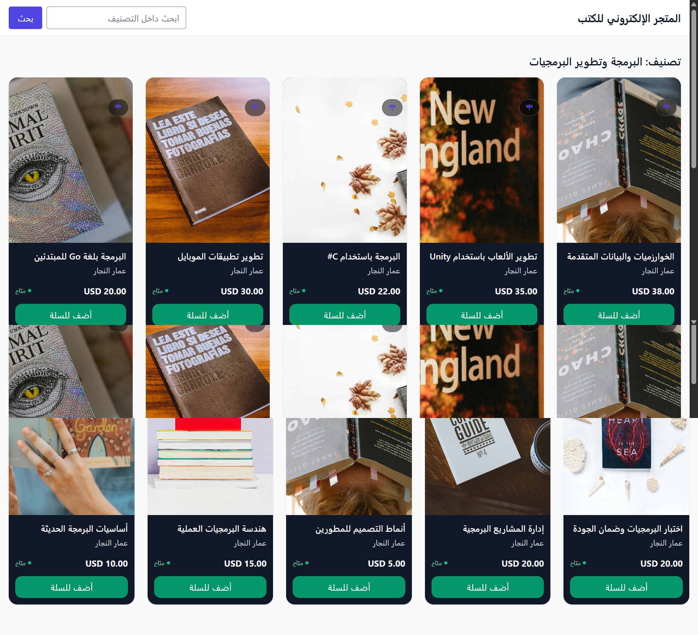

# Online Bookstore System

A modern, RTL-ready (Arabic) online bookstore built with **Laravel 12**, featuring a product catalog, cart & checkout, **Stripe** payments (test mode), invoice PDFs, email notifications via **Mailpit**, role-based admin panel (Admin/Seller/Customer), and a clean Tailwind CSS UI.

  

---

## Table of Contents

- [Screenshots](#screenshots)
- [Features](#features)
- [Tech Stack](#tech-stack)
- [Requirements](#requirements)
- [Quick Start (TL;DR)](#quick-start-tldr)
- [Option A (Recommended): Docker via Laravel Sail](#option-a-recommended-docker-via-laravel-sail)
  - [Step 1 — Clone & configure](#step-1--clone--configure)
  - [Step 2 — Boot services](#step-2--boot-services)
  - [Step 3 — App key, storage, and migrations](#step-3--app-key-storage-and-migrations)
  - [Step 4 — Frontend assets](#step-4--frontend-assets)
  - [Step 5 — Stripe (test mode) & webhook](#step-5--stripe-test-mode--webhook)
  - [Useful Sail commands](#useful-sail-commands)
  - [Windows + WSL2 tips](#windows--wsl2-tips)
- [Option B: Native (No Docker)](#option-b-native-no-docker)
- [Environment Variables](#environment-variables)
- [Mailpit (Local Email)](#mailpit-local-email)
- [Users & Roles](#users--roles)
- [Queues (Optional but Recommended)](#queues-optional-but-recommended)
- [Common Tasks](#common-tasks)
- [Troubleshooting](#troubleshooting)
- [Production Notes](#production-notes)
- [Project Structure](#project-structure)
- [Contributing](#contributing)
- [Security](#security)
- [License](#license)

---

## لقطات الشاشة | Screenshots


### 1) 🏠 الصفحة الرئيسية | Home

**الوصف (AR):** صفحة الهبوط تعرض الكتب المميّزة والأقسام وروابط التصفّح والبحث السريع.
**Description (EN):** Landing page with featured books, categories, quick navigation, and search entry. 


---

### 2) 🗂️ صفحة التصنيف | Category

**الوصف (AR):** تصفّح كتب تصنيف محدّد مع فرز/ترقيم صفحات.
**Description (EN):** Browse books within a specific category with sorting and pagination. 


---

### 3) 🏢 صفحة الناشر | Publisher

**الوصف (AR):** عرض معلومات الناشر وجميع كتبه المنشورة في المتجر.
**Description (EN):** Publisher profile and catalog of all published books.


---

### 4) ✍️ صفحة المؤلف | Author

**الوصف (AR):** نبذة المؤلف وقائمة بأعماله مع روابط للكتب.
**Description (EN):** Author bio and list of authored books with links.


---

### 5) 📘 تفاصيل الكتاب + المراجعات | Book Details + Reviews

**الوصف (AR):** صفحة المنتج؛ صور/وصف/سعر/توفر/إضافة للسلة، واستعراض/كتابة مراجعات (RTL).
**Description (EN):** Product page with images, description, price, stock, add-to-cart, and reviews.


---

### 6) 🛒 سلة التسوّق | Cart

**الوصف (AR):** مراجعة العناصر، تحديث الكميات/الحذف، متابعة الدفع.
**Description (EN):** Review items, update quantities/remove, proceed to checkout.


---

### 7) 💳 صفحة إتمام الطلب | Checkout

**الوصف (AR):** إدخال عناوين الشحن/الفوترة مع ملخّص الطلب قبل الدفع.
**Description (EN):** Enter shipping/billing information with order summary before payment.


---

### 8) 🧾 الدفع عبر Stripe | Stripe Payment

**الوصف (AR):** تأكيد الدفع ببطاقة الاختبار، إنشاء PaymentIntent، تحديث الحالة عبر Webhook.
**Description (EN):** Confirm card payment (test), PaymentIntent creation, webhook-based status updates.


---

### 9) ✅ صفحة الشكر (اختياري) | Thank You (Optional)

**الوصف (AR):** تأكيد إنشاء الطلب مع أزرار متابعة الطلب/الفاتورة.
**Description (EN):** Post-purchase confirmation with links to order and invoice.


---

### 10) 📦 طلباتي (قائمة) | My Orders (List)

**الوصف (AR):** قائمة طلبات العميل مع حالة الدفع والطلب وترقيم الصفحات.
**Description (EN):** Customer’s order list with payment/order status and pagination.


---

### 11) 🔍 تفاصيل الطلب (عميل) | Order Details (Customer)

**الوصف (AR):** تفصيل العناصر والمبالغ والإجراءات (دفع/إلغاء/فاتورة).
**Description (EN):** Full breakdown of items, totals, and actions (pay/cancel/invoice).


---

### 12) 🧾 فاتورة HTML | Invoice (HTML)

**الوصف (AR):** عرض الفاتورة للطباعة باتجاه عربي (RTL).
**Description (EN):** Printable invoice view with Arabic RTL styling.


---

### 13) 📄 فاتورة PDF | Invoice PDF

**الوصف (AR):** تنزيل الفاتورة بصيغة PDF (mPDF) مع دعم العربية.
**Description (EN):** Downloadable mPDF invoice with Arabic support.


---

## 👑 الإدارة | Admin

### 14) 🧭 لوحة التحكم | Admin Dashboard

**الوصف (AR):** نظرة عامة وإحصاءات وروابط سريعة للإدارة.
**Description (EN):** Overview, quick stats, and shortcuts for administration.


---

### 15) 📚 إدارة الكتب – القائمة | Admin Books – Index

**الوصف (AR):** استعراض وإدارة الكتب مع بحث/ترقيم.
**Description (EN):** Manage books with listing, search, and pagination.


---

### 16) ✏️ إدارة الكتب – إنشاء/تعديل | Admin Books – Create/Edit

**الوصف (AR):** إنشاء كتاب جديد أو تعديل البيانات والسعر والمخزون والصور.
**Description (EN):** Create new book or edit metadata, pricing, stock, and images.


---

### 17) 🏷️ التصنيفات | Admin Categories

**الوصف (AR):** إدارة التصنيفات وإسنادها للكتب.
**Description (EN):** Manage categories and assign them to books.


---

### 18) 🏢 الناشرون | Admin Publishers

**الوصف (AR):** إنشاء/تعديل الناشرين وإدارة كتبهم.
**Description (EN):** Create/edit publishers and manage their books.


---

### 19) ✍️ المؤلفون | Admin Authors

**الوصف (AR):** إدارة المؤلفين وربطهم بالكتب.
**Description (EN):** Manage authors and link them to books.


---

### 20) 👥 المستخدمون | Admin Users

**الوصف (AR):** إدارة المستخدمين والصلاحيات (Spatie Roles/Permissions).
**Description (EN):** Manage users and roles/permissions (Spatie).


---

### 21) ⭐ مراجعات | Admin Reviews (Moderation)

**الوصف (AR):** مراجعة/قبول/رفض التقييمات مع بحث وتصنيف.
**Description (EN):** Moderate reviews with search and status filters.


---

### 22) 🧾 الطلبات – القائمة مع فلاتر | Admin Orders – Index (Filters)

**الوصف (AR):** بحث وترشيح الطلبات حسب الحالة/الدفع/التاريخ/البريد.
**Description (EN):** Search and filter orders by status/payment/date/email.


---

### 23) 🔎 تفاصيل الطلب وإجراءات | Admin Order – Details & Actions

**الوصف (AR):** عرض كامل للطلب (عناصر/مبالغ/معرّفات Stripe) مع إجراءات (استرجاع/تغيير حالة/تتبع شحنة).
**Description (EN):** Full order view (items/totals/Stripe IDs) with actions (refund/status/ship).


---

## 🔐 المصادقة والأخطاء | Auth & Errors

### 24) 🔑 تسجيل الدخول | Login

**الوصف (AR):** وصول آمن بحقول البريد/كلمة المرور ودعم RTL.
**Description (EN):** Secure access with email/password and RTL-friendly UI.


---

### 25) 📝 إنشاء حساب | Register

**الوصف (AR):** إنشاء حساب جديد مع التحقق من البيانات.
**Description (EN):** Sign-up form with basic validation flows.


---

### 26) ✉️ تأكيد البريد | Email Verification

**الوصف (AR):** تفعيل البريد الإلكتروني قبل الميزات الحسّاسة.
**Description (EN):** Verify email before sensitive features.


---

### 27) 🚫 خطأ 403 | Error 403

**الوصف (AR):** شاشة ودّية عند عدم السماح بالوصول.
**Description (EN):** Friendly unauthorized screen for forbidden access.


---

## 📬 رسائل البريد (Mailpit) | Transactional Emails (Mailpit)

> **Open Mailpit:** [http://localhost:8025](http://localhost:8025)

### 28)📨 تأكيد إنشاء الطلب | Order Placed

**AR:** رسالة إنشاء الطلب مع ملخص مختصر ورابط التتبع.
**EN:** “Order placed” confirmation with brief summary and link. 


### 29)💳 تأكيد الدفع (مع فاتورة PDF) | Order Paid (Invoice PDF)

**AR:** تأكيد الدفع وإرفاق الفاتورة PDF (RTL).
**EN:** Payment confirmation with invoice PDF attached (RTL-friendly). 


### 30)📦 تم الشحن | Order Shipped

**AR:** إشعار الشحن مع رقم/رابط التتبع.
**EN:** Shipping notice with tracking number/link. 

### 31)❌ تم الإلغاء | Order Cancelled

**AR:** إشعار إلغاء الطلب واسترجاع المبلغ (إن وُجد).
**EN:** Cancellation email and refund note if applicable. 


### 32) 🔄 تحديث حالة الطلب | Order Status Updated

**AR:** إشعار تغيّر الحالة (processing/shipped...).
**EN:** Status change notice (processing/shipped...). 


---

## 🧩 مكوّنات مشتركة | Shared UI Components

### 33) ⏳ مُحمّل الصفحة العام | Global Page Loader

**AR:** ستار تحميل يغطي الشاشة مع تأثير Ripple على الأزرار.
**EN:** Full-screen loader overlay with button ripple effect.


### 34) ⚪ مُحمّل مركزي داخل بطاقة | Centered Loader (Inline)

**AR:** لودر مركزي أنيق يستخدم داخل بطاقة/مودال.
**EN:** Elegant centered loader for cards/modals.


---

## 🧰 أدوات التطوير | Dev Tools

### 35) 📮 صندوق بريد Mailpit | Mailpit Inbox

**AR:** استعراض رسائل النظام أثناء التطوير.
**EN:** Inspect transactional emails during development.
**Open:** [Mailpit](http://localhost:8025) 


### 36) 💼 Stripe Test Dashboard

**AR:** متابعة عمليات الدفع التجريبية وأحداث الويب هوك.
**EN:** Monitor test payments and webhooks.


---

## Features

- 📚 **Catalog & search**: Books with categories, publishers, authors, cover images, stock, pricing.
- 🛒 **Cart & checkout** with quantity controls and stock checks.
- 💳 **Stripe Payments (test mode)** with **webhook** handling (`payment_intent.succeeded`, `charge.refunded`), idempotent intent creation, and robust order state transitions.
- 🧾 **Invoice PDF** (mPDF) attached to payment confirmation emails.
- 📬 **Email notifications** (order placed, paid, shipped, cancelled, status updated) via **Mailpit** in local/dev.
- 👥 **RBAC** via Spatie Permission (Admin / Seller / Customer).
- ⭐ **Reviews & ratings** with moderation (Admin/Seller).
- 🌍 **RTL & Arabic**: Layouts are `dir="rtl"`, typography and emails tuned for Arabic.
- ⚡ **UI niceties**: Page loader & button ripple, Tailwind CSS, Vite bundling.
- 🧰 Admin panel: Orders, refunds (Stripe), shipping (tracking number, carrier, shipped state), inventory updates.

---

## Tech Stack

- **Backend**: Laravel 12, PHP 8.2+
- **Payments**: Stripe (test mode)
- **DB/Cache**: MySQL 8+, Redis
- **Frontend**: Tailwind CSS, Vite, (Alpine/Livewire/Jetstream if included)
- **Email (local)**: Mailpit
- **PDF**: mPDF

---

## Requirements

**Common**
- Git
- Node.js **18+** and npm **9+**
- Stripe account (test mode)

**Option A — Docker/Sail (Recommended)**
- Docker Desktop (macOS/Windows) or Docker Engine (Linux)
- (Windows) WSL2 with Ubuntu

**Option B — Native**
- PHP **8.2+** with: `ctype`, `curl`, `dom`, `fileinfo`, `mbstring`, `openssl`, `pdo`, `tokenizer`, `xml`, `bcmath`, `gd`
- Composer **2.5+**
- MySQL **8+** (or MariaDB 10.6+)
- (Optional) Redis 6+

---

## Quick Start (TL;DR)

```bash
# 1) Clone
git clone https://github.com/<org-or-user>/<repo>.git
cd <repo>

# 2) Copy env
cp .env.example .env

# 3) Install dependencies
composer install
npm install

# 4) Run with Sail (Docker)
./vendor/bin/sail up -d

# 5) App key, storage, migrate
./vendor/bin/sail artisan key:generate
./vendor/bin/sail artisan storage:link
./vendor/bin/sail artisan migrate

# 6) Build assets (dev)
npm run dev

# 7) Stripe webhook (adjust URL if not Sail)
stripe listen --forward-to http://localhost/payments/stripe/webhook --log-level info
# paste whsec_... into STRIPE_WEBHOOK_SECRET in .env

# App at: http://localhost
# Mailpit UI at: http://localhost:8025  (SMTP: 1025)
```

---

## Option A (Recommended): Docker via Laravel Sail

### Step 1 — Clone & configure

```bash
git clone https://github.com/<org-or-user>/<repo>.git
cd <repo>
cp .env.example .env
composer install
npm install
```

In `.env`, use the Sail service hosts:
```dotenv
APP_NAME="Online Bookstore"
APP_ENV=local
APP_URL=http://localhost

DB_CONNECTION=mysql
DB_HOST=mysql
DB_PORT=3306
DB_DATABASE=bookstore
DB_USERNAME=sail
DB_PASSWORD=password

REDIS_HOST=redis

MAIL_MAILER=smtp
MAIL_HOST=mailpit
MAIL_PORT=1025
MAIL_FROM_ADDRESS="no-reply@example.test"
MAIL_FROM_NAME="${APP_NAME}"

STRIPE_KEY=pk_test_xxx
STRIPE_SECRET=sk_test_xxx
STRIPE_WEBHOOK_SECRET=whsec_xxx   # fill after stripe listen
```

### Step 2 — Boot services

```bash
./vendor/bin/sail up -d
```

> Default ports  
> - App: **http://localhost**  
> - Mailpit UI: **http://localhost:8025** (SMTP on **1025**)  
> - MySQL: **3306**  
> - Redis: **6379**

If a port is **already in use**, stop the local service or edit `docker-compose.yml` to remap ports, then `sail down && sail up -d`.

### Step 3 — App key, storage, and migrations

```bash
./vendor/bin/sail artisan key:generate
./vendor/bin/sail artisan storage:link
./vendor/bin/sail artisan migrate
# ./vendor/bin/sail artisan db:seed   # if you have seeders
```

### Step 4 — Frontend assets

```bash
npm run dev   # development
# or
npm run build # production
```

### Step 5 — Stripe (test mode) & webhook

Install Stripe CLI and log in:

```bash
stripe login
```

Start a webhook listener that forwards to your app (Sail default URL):

```bash
stripe listen --forward-to http://localhost/payments/stripe/webhook --log-level info
```

Copy the printed `whsec_...` value into `.env` as `STRIPE_WEBHOOK_SECRET`, then try a test payment (e.g., card `4242 4242 4242 4242`, future date, any CVC). Verify:

- Stripe Dashboard (test mode) shows the payment
- `payment_intent.succeeded` → **200** in Stripe CLI logs
- Order status updates to **paid / processing**
- Stock decreases
- A confirmation email (with PDF invoice) appears in **Mailpit** (`http://localhost:8025`)

#### Useful Sail commands

```bash
./vendor/bin/sail artisan optimize:clear
./vendor/bin/sail artisan route:list
./vendor/bin/sail artisan tinker
./vendor/bin/sail artisan queue:work
./vendor/bin/sail npm run dev
./vendor/bin/sail npm run build

./vendor/bin/sail down
./vendor/bin/sail restart
```

Add an **alias** to your shell for convenience:

```bash
alias sail='[ -f sail ] && sh sail || sh vendor/bin/sail'
```

#### Windows + WSL2 tips
- Keep your project **inside the Linux filesystem** (e.g., `~/code/bookstore`) for performance.
- Don’t run heavy operations from `/mnt/c` or `/mnt/d` paths.
- Use `localhost` from Windows browser to reach Sail services.

---

## Option B: Native (No Docker)

1. Install PHP 8.2+, Composer, Node 18+, and MySQL 8+.
2. Clone & install:
   ```bash
   git clone https://github.com/<org-or-user>/<repo>.git
   cd <repo>
   cp .env.example .env
   composer install
   npm install
   ```
3. In `.env`, set your local DB credentials (e.g., `DB_HOST=127.0.0.1`) and mailer (Mailpit or other SMTP).
4. Generate key, link storage, migrate:
   ```bash
   php artisan key:generate
   php artisan storage:link
   php artisan migrate
   ```
5. Start server & assets:
   ```bash
   php artisan serve
   npm run dev
   ```
6. Stripe webhook (adjust URL to your serve port, e.g., `http://127.0.0.1:8000`):
   ```bash
   stripe listen --forward-to http://127.0.0.1:8000/payments/stripe/webhook --log-level info
   ```
   Paste `whsec_...` into `.env`.

---

## Environment Variables

Key variables used by the app:

```dotenv
APP_NAME="Online Bookstore"
APP_ENV=local
APP_DEBUG=true
APP_URL=http://localhost

DB_CONNECTION=mysql
DB_HOST=mysql           # 127.0.0.1 if native
DB_PORT=3306
DB_DATABASE=bookstore
DB_USERNAME=sail
DB_PASSWORD=password

REDIS_HOST=redis        # 127.0.0.1 if native

MAIL_MAILER=smtp
MAIL_HOST=mailpit       # 127.0.0.1 if native
MAIL_PORT=1025
MAIL_FROM_ADDRESS="no-reply@example.test"
MAIL_FROM_NAME="${APP_NAME}"

STRIPE_KEY=pk_test_xxx
STRIPE_SECRET=sk_test_xxx
STRIPE_WEBHOOK_SECRET=whsec_xxx
```

---

## Mailpit (Local Email)

- UI: `http://localhost:8025`
- SMTP: `mailpit:1025` (Sail) or `127.0.0.1:1025` (native)
- All outgoing app emails appear here (order placed/paid/shipped/etc.), with Arabic & PDF attachments (when applicable).

---

## Users & Roles

The project uses **Spatie/Permission** with roles: **Admin**, **Seller**, **Customer**.

- Register through the UI, then grant roles via your admin interface (or Tinker):

```php
// Example (Tinker):
$user = \App\Models\User::where('email','you@example.com')->first();
$user->assignRole('Admin'); // or 'Seller'
```

Some admin routes are protected by `role:Admin` or `role:Admin|Seller`.

---

## Queues (Optional but Recommended)

To send emails and heavy tasks asynchronously:

```dotenv
QUEUE_CONNECTION=database
```

```bash
php artisan queue:table
php artisan migrate
# Run worker:
# Sail:
./vendor/bin/sail artisan queue:work
# Native:
php artisan queue:work
```

---

## Common Tasks

```bash
# Clear caches
php artisan optimize:clear

# List routes
php artisan route:list

# Run tests (if provided)
php artisan test
```

With Sail, prefix commands with `./vendor/bin/sail`.

---

## Troubleshooting

- **`vendor/bin/sail: No such file or directory`**  
  Run `composer install` first. Ensure `vendor/` exists.

- **Ports (3306, 1025, 8025) already in use**  
  Stop local MySQL/Mailpit or edit `docker-compose.yml` to remap, then `sail down && sail up -d`.

- **Stripe “Invalid signature” (400)**  
  Make sure `STRIPE_WEBHOOK_SECRET` matches the most recent `stripe listen` session output.

- **Slow responses locally**  
  - Move project **inside** WSL’s Linux filesystem (not `/mnt/c` or `/mnt/d`).
  - Disable Xdebug.
  - Cache config/routes (`php artisan config:cache`, `route:cache`) in non-dev.

- **Emails not showing**  
  Confirm Mailpit is running and `.env` points to it. Check `queue:work` if queued.

---

## Production Notes

- Use a real SMTP provider (Mailgun, SES, etc.) instead of Mailpit.
- Set `APP_ENV=production`, `APP_DEBUG=false`, correct `APP_URL`.
- Run `php artisan migrate --force`.
- Build assets: `npm run build`.
- Set up queue workers (Supervisor or systemd).
- Configure an HTTPS domain, real Stripe webhook endpoint in the Stripe Dashboard.
- Harden permissions on `storage/` and `bootstrap/cache/`.

---

## Contributing

Contributions are welcome!  
Please open an issue to discuss changes, then submit a PR with clear commits and descriptions.

---

## Security

If you discover a security issue, please **do not** open a public issue.  
Email the maintainer directly and allow reasonable time for a fix.

---

## License

This project is open-sourced software licensed under the **MIT license**.

---

**Enjoy!** Spin it up with **Sail**, test a Stripe payment, and check Mailpit for emails & invoices. The UI is RTL-aware out of the box—happy building!
